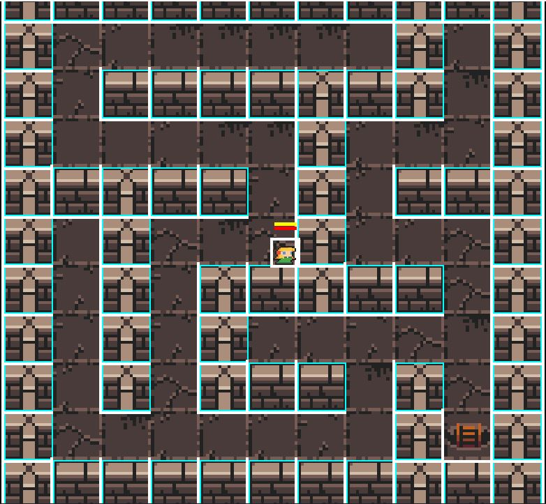

# Labyrinth generation

## Description

Deep-first search (DFS) algorithm is used to generate Labyrinth. Starting with setted or randomly selected cell, visit random neighbouring cell and proceeding from it while not meeting a dead end. In case of meeting dead end, algorithm goes back to previosly visited cells.

## Why DFS?

DFS algorithm allows to create Labyrinth with one solution

## Parameters

Uses LabyrinthBuilder::BuildingParameter, which have:
- width - defines width of Labyrinth
- heigth - defines heigth of Labyrinth
- isAdjustingSizeAndStart - defines if size and start position will be adjust to use Labyrinth size fully
- randSeed - seed for std::srand, uses std::time(nullptr) if equal to -1
- startPosition - cell to start DFS from, uses random if any of coordinates are negative

## Usage sample
Generating 11x11 Labyrinth:
~~~
    Roguelike::LabyrinthBuilder builder;
    LabyrinthBuilder::BuildingParameters labyrinthParameters = {.width = 11,
                            .heigth = 11,
                            .isAdjustingSizeAndStart = true,
                            .randSeed = -1}};
    builder.Generate(labyrinthParameters);
    Roguelike::Labyrinth labyrinth = builder.ConstructLabyrinth();    
~~~

Result:

